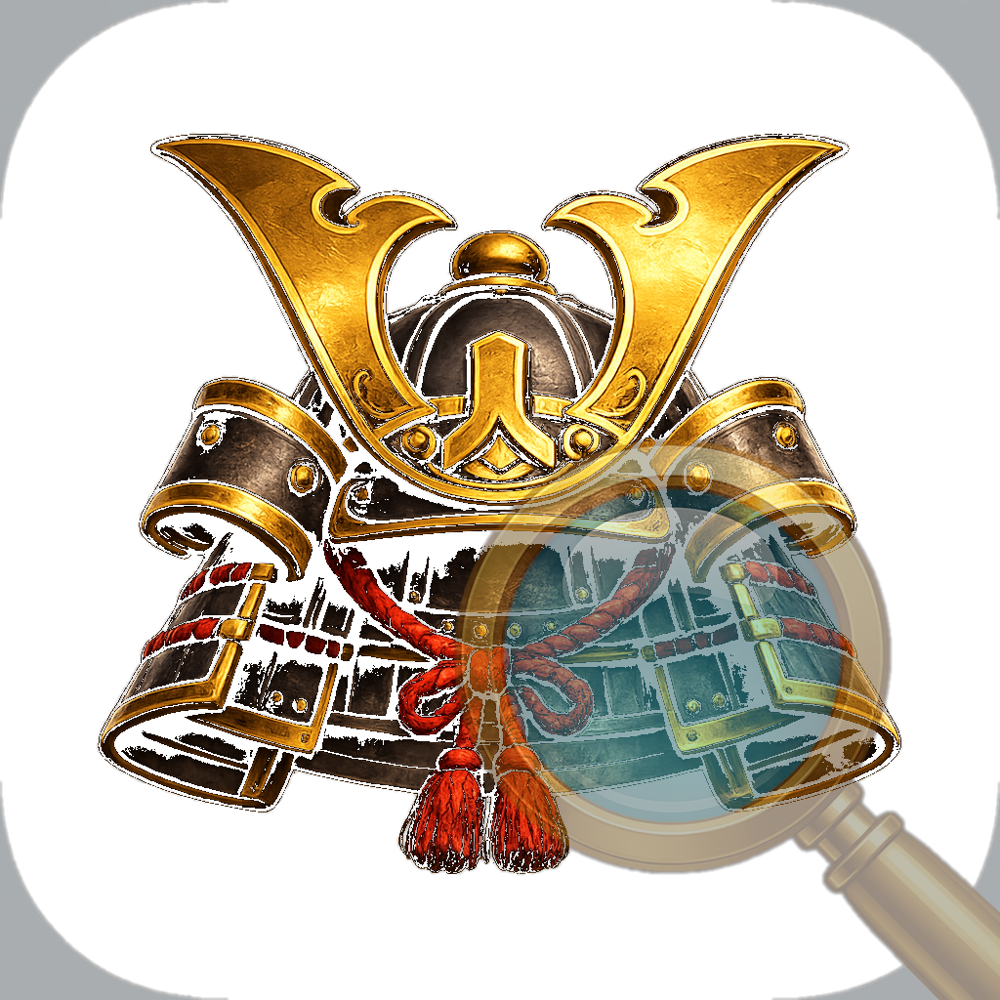
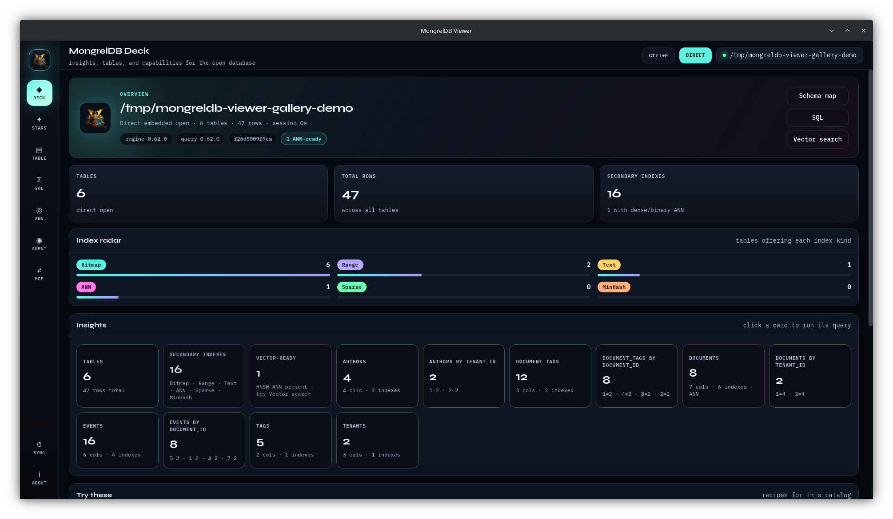
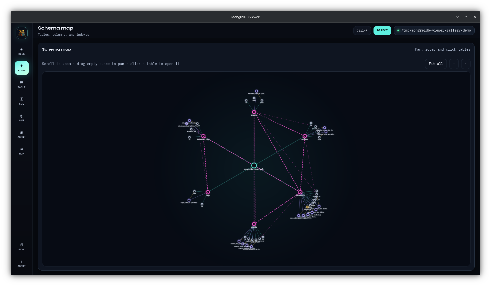
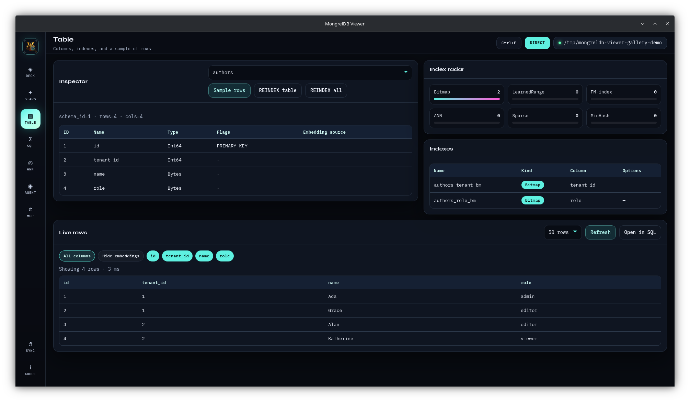
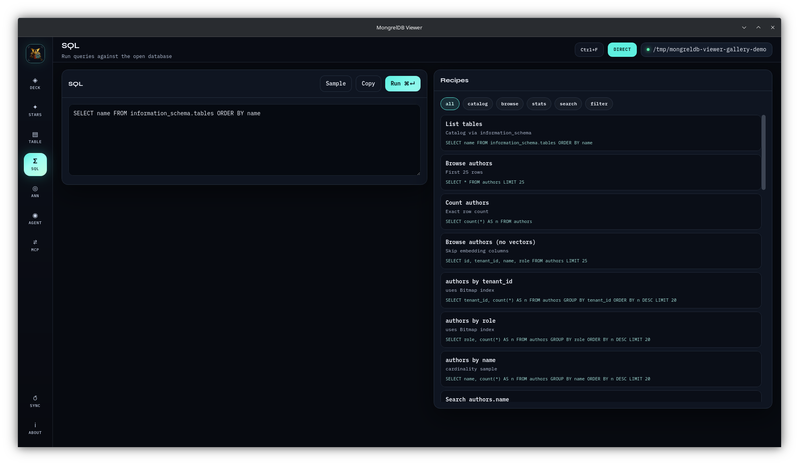
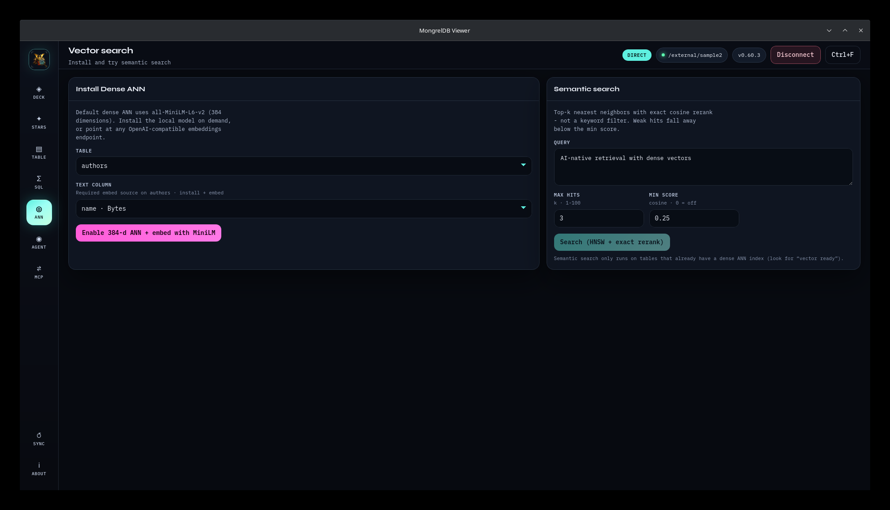
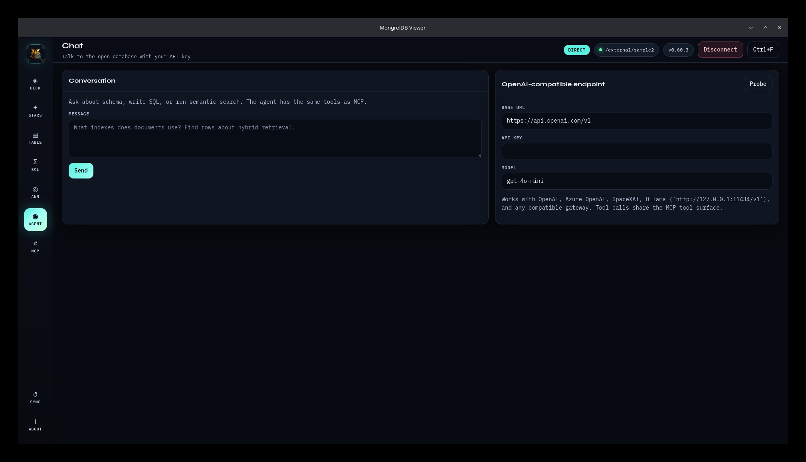
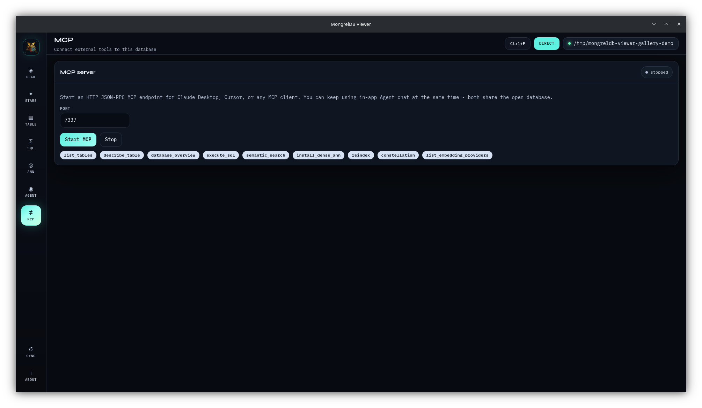
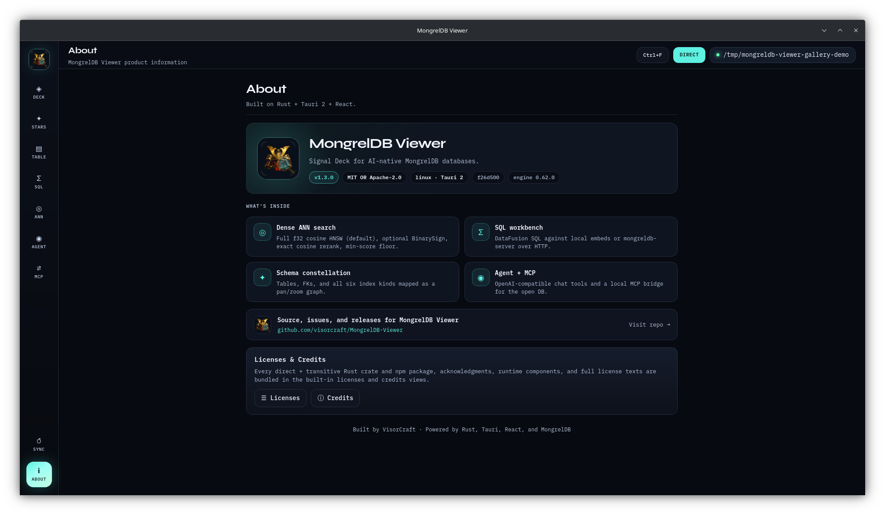

<p align="center">
  
</p>

<h1 align="center">MongrelDB Viewer</h1>

<p align="center">
  <b>Signal Deck for <a href="https://github.com/visorcraft/MongrelDB">MongrelDB</a> - open a local root or server and make the engine’s AI-native strengths visible and interactive.</b>
  <br />
  Direct embedded open · multi-client HTTP · schema constellation · six index kinds · dense ANN + exact rerank · SQL workbench · OpenAI-compatible agent · MCP bridge
</p>

<p align="center">
  <a href="https://github.com/visorcraft/MongrelDB-Viewer/releases/latest"></a>
  
  
  
  
</p>

---

## Screenshots

Captured against a local demo dataset in Direct Mode.

| Deck | Schema map |
|:----:|:----------:|
|  |  |

| Table browser | SQL workbench |
|:-------------:|:-------------:|
|  |  |

| Vector search (ANN) | Agent chat |
|:-------------------:|:----------:|
|  |  |

| MCP bridge | About |
|:----------:|:-----:|
|  |  |

Full page guides: [`docs/`](docs/README.md).

---

## Why this client

MongrelDB has 30+ language bindings. For a Tauri desktop viewer the **best fit is the native Rust engine** (`mongreldb-core` + `mongreldb-query`):

- Same process as the UI - no daemon required for local roots  
- Full multi-table `Database` + DataFusion SQL + scored AI functions  
- Exclusive `_meta/.lock` handled correctly in-process  
- Dense ANN install and embedding providers register against the real core APIs  

## Features

| Surface | What it showcases |
|---|---|
| **Signal Deck** | Table roster, O(1) counts, index capability chips |
| **Schema Constellation** | Living graph of tables → columns → six index kinds |
| **Table Inspector** | Columns, flags, **index radar** (Bitmap / PGM / FM / ANN / Sparse / MinHash) |
| **SQL Console** | DataFusion 54 SQL, DDL/DML, scored search functions |
| **Dense ANN Lab** | Install 384-d HNSW (default **all-MiniLM-L6-v2**), backfill, semantic search + exact rerank |
| **Agent Nexus** | OpenAI-compatible chat with tool-calling against the open DB |
| **MCP Bridge** | HTTP JSON-RPC MCP server (and `--mcp-stdio`) for terminal/IDE clients |

MCP and in-app chat are **not exclusive** - both can use the same open database and tool surface at once.

## Prerequisites

- Rust **1.88+** (MongrelDB rust-version)
- Node.js **22+**

MongrelDB is pulled from crates.io (`mongreldb-core` / `mongreldb-query` **0.61.1** - latest release). No engine source checkout required.

Linux also needs typical Tauri system libs (`webkit2gtk`, `libayatana-appindicator`, etc.). See [Tauri prerequisites](https://v2.tauri.app/start/prerequisites/).

## Develop

```bash
cd mongreldb-viewer
npm install
npm run tauri dev
```

On Linux the binary sets WebKitGTK Wayland-safe defaults at startup
(`WEBKIT_DISABLE_DMABUF_RENDERER=1`, `WEBKIT_DISABLE_COMPOSITING_MODE=1`) so you
should not need manual `GDK_BACKEND=x11` workarounds. Export those vars yourself
only if you need to override the defaults.

## Build

```bash
npm run tauri build
```

Optional: disable local ONNX embeddings (remote OpenAI-compatible only):

```toml
# src-tauri/Cargo.toml
default = []   # instead of ["local-embeddings"]
```

## Connect

### Direct (exclusive, embedded)

1. Choose **Direct folder**
2. Point at a MongrelDB root (folder with `CATALOG` / `_meta` / `tables`), or browse with the folder picker
3. Optional catalog credentials / encryption passphrase
4. **Open database** - or **Create demo DB** in an empty folder  
5. **Disconnect** from the top bar when finished (releases the exclusive lock)

### Server (multi-client)

```sh
mongreldb-server /path/to/db 8453
```

1. Choose **mongreldb-server**
2. URL (loopback example: `http://127.0.0.1:8453`)
3. Optional bearer token / basic auth when the server requires them
4. **Connect to server**

Both modes share the same explorer, SQL console, chat, and MCP tools.

## Documentation

User guides live in [`docs/`](docs/README.md):

- [Onboarding](docs/onboarding.md) - first launch, demo DB, connection modes  
- [Deck](docs/deck.md) · [Schema map](docs/constellation.md) · [Table](docs/table.md)  
- [SQL](docs/sql.md) · [Vector search (ANN)](docs/ann.md) · [Agent](docs/agent.md) · [MCP](docs/mcp.md)  
- [About / Licenses / Credits](docs/about.md)

## Dense ANN (384-d)

Default local model: **`all-MiniLM-L6-v2`** (384 dimensions), loaded on demand via [fastembed](https://github.com/Anush008/fastembed-rs) into the user cache (`~/.cache/mongreldb-viewer/models` on Linux).

From **ANN Lab**:

1. Pick a table  
2. Optionally set a text column to backfill  
3. **Enable 384-d ANN + embed with MiniLM**  
4. Run semantic search (HNSW candidates + exact cosine rerank when available)  

You can also configure a **remote OpenAI-compatible embeddings** endpoint from the agent/settings path (provider id `viewer-remote` style) - any model/dimension the remote returns is accepted as long as it matches the column.

## MCP

### In-app HTTP

1. Open a database  
2. **MCP → Start MCP** (default `http://127.0.0.1:7337/mcp`)  
3. Point Claude Desktop / Cursor / custom clients at that URL  

### Stdio (terminal)

```bash
MONGRELDB_VIEWER_PATH=/path/to/db \
  ./src-tauri/target/release/mongreldb-viewer --mcp-stdio
```

### Tools

- `list_tables` · `describe_table` · `database_overview` · `constellation`  
- `execute_sql` · `semantic_search` · `install_dense_ann`  
- `list_embedding_providers`  

## OpenAI-compatible chat

In **Agent Nexus**, set:

- Base URL (e.g. `https://api.openai.com/v1`, Ollama `http://127.0.0.1:11434/v1`, …)  
- API key  
- Model  

The co-pilot uses the **same tools as MCP** and is instructed to showcase MongrelDB’s multi-index AI retrieval honestly (no invented vectors).

## Architecture

```text
src/                     React Signal Deck UI
src-tauri/
  src/
    db/                  open/inspect/sql/ann against mongreldb-*
    embeddings/          local MiniLM + remote OpenAI-compatible
    mcp/                 JSON-RPC tools + HTTP/stdio transports
    chat/                OpenAI tool-calling loop
    commands/            Tauri invoke surface
```

Engine crates (crates.io):

```toml
mongreldb-core  = "0.61.1"
mongreldb-query = "0.61.1"
```

## License

MIT OR Apache-2.0 (aligned with MongrelDB).
