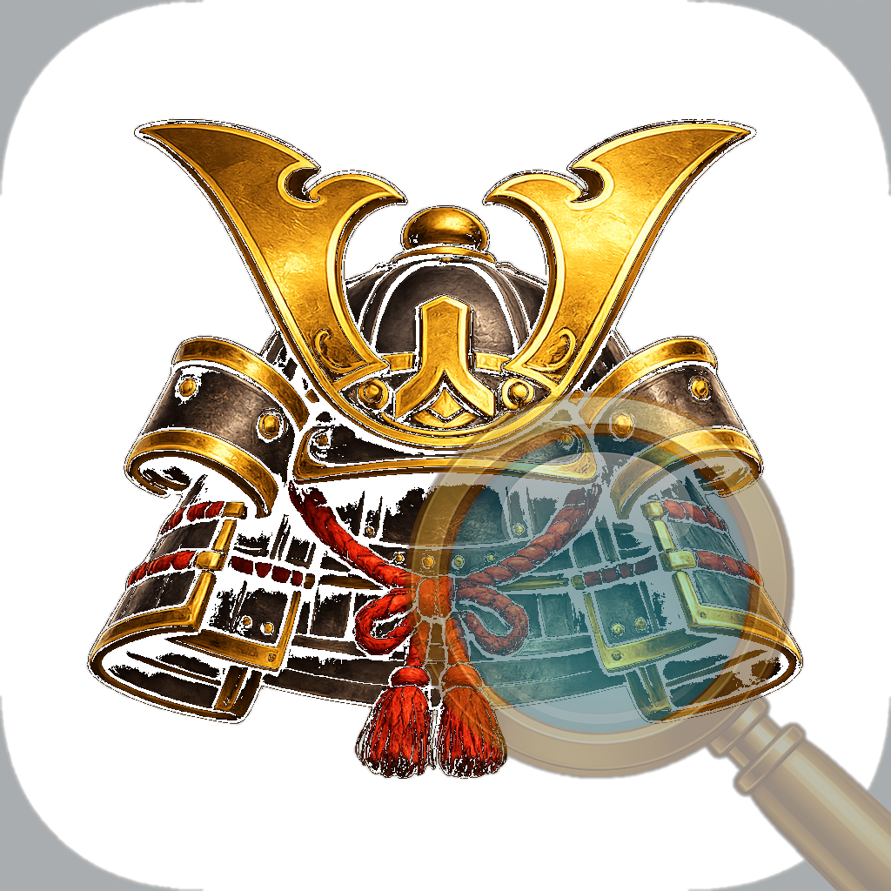
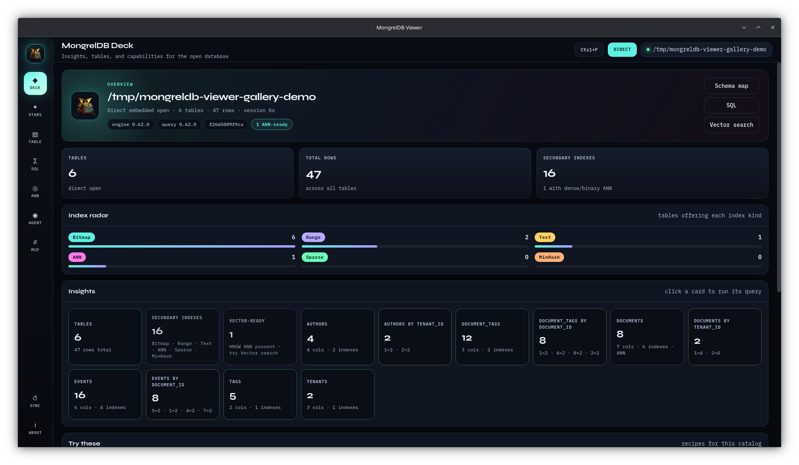
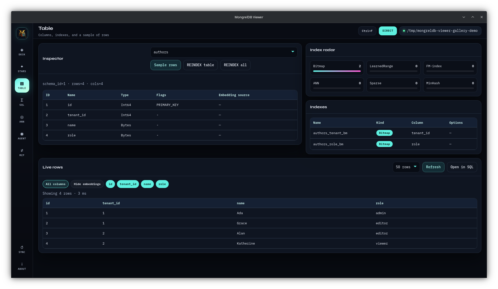
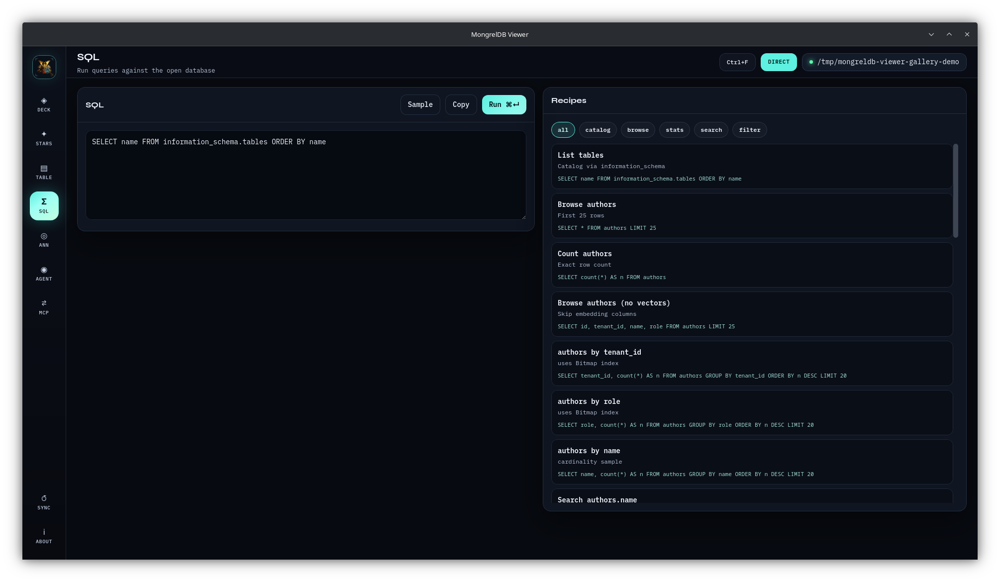
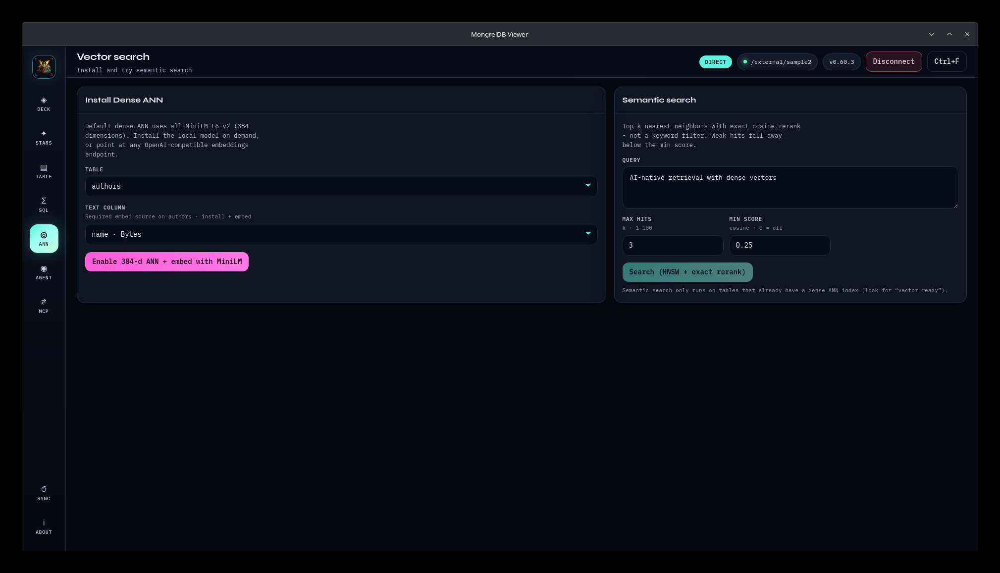
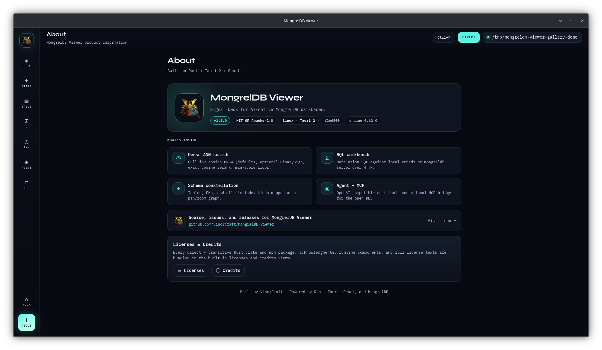

<p align="center">
  
</p>

<h1 align="center">MongrelDB Viewer</h1>

<p align="center">
  <strong>A desktop Signal Deck for <a href="https://github.com/visorcraft/MongrelDB">MongrelDB</a>.</strong>
  <br />
  Inspect schemas and indexes, browse rows, run SQL, build dense ANN search,
  chat through an OpenAI-compatible model, and expose the open database over MCP.
</p>

MongrelDB Viewer is free and open source. Use it as a [local vector database GUI](https://www.mongreldb.com/local-vector-database-gui/) or expose the open database through its [local vector database MCP server](https://www.mongreldb.com/local-vector-database-mcp/).

<p align="center">
  <a href="https://github.com/visorcraft/MongrelDB-Viewer/releases/latest"></a>
  
  
  
  
</p>

## What it does

MongrelDB Viewer has two connection modes:

| Capability | Direct folder | `mongreldb-server` |
| --- | :---: | :---: |
| Open style | Embedded, exclusive filesystem lock | Multi-client HTTP |
| Browse schema and rows | Yes | Yes |
| Run SQL, DDL, and DML | Yes | Yes, when the server permits it |
| Show foreign-key graph | Yes | Not exposed by the current server adapter |
| Native `retrieve_text` provenance | Yes | No, SQL ANN fallback |
| Install, backfill, or rebuild ANN from the UI | Yes | No |
| Run REINDEX | Yes | Sent as server SQL |
| Agent and in-app MCP | Yes | Yes |
| Catalog credentials and encryption passphrase | Yes | Server auth only |

Direct mode uses `mongreldb-core` and `mongreldb-query` in the application
process. Server mode uses `mongreldb-client` against a running daemon. See
[connection modes](docs/connections.md) before opening production data.

## Gallery

Screenshots use the bundled six-table demo database.

| Deck | Schema map |
| :---: | :---: |
|  |  |

| Table browser | SQL workbench |
| :---: | :---: |
|  |  |

| Vector search | Agent chat |
| :---: | :---: |
|  |  |

| MCP bridge | About |
| :---: | :---: |
|  |  |

## Install

Download a package, when attached, from
[GitHub Releases](https://github.com/visorcraft/MongrelDB-Viewer/releases).
If no package matches your platform, build from source:

```sh
git clone https://github.com/visorcraft/MongrelDB-Viewer.git
cd MongrelDB-Viewer
npm ci
npm run tauri build
```

Source builds need Rust **1.88+**, Node.js **22+**, and the native libraries
required by Tauri 2. Bundles are written below
`src-tauri/target/release/bundle/`.

See [installation and builds](docs/installation.md) for platform prerequisites,
development mode, Linux display behavior, upgrades, and model downloads.

## Five-minute tour

```sh
npm ci
npm run tauri dev
```

Then:

1. Leave **Direct folder** selected.
2. Choose an empty directory.
3. Click **Create demo DB**.
4. Open **Deck**, **Stars**, **Table**, and **SQL**.
5. In **ANN**, search `hybrid retrieval across indexes`.

Demo creation writes six tables, foreign keys, representative secondary
indexes, a 384-dimensional embedding column, and dense HNSW ANN. The first run
may download `all-MiniLM-L6-v2`. If the download is unavailable, demo creation
can fall back to zero vectors; use **Re-embed from text column** after the model
becomes available.

The demo button hides after its first successful use. Reopen the demo through
**Recent** or **Direct folder** on later launches. The complete walkthrough and
schema are in [first launch and demo](docs/onboarding.md).

## Product surfaces

| Surface | Purpose |
| --- | --- |
| **Deck** | Connection metadata, table and row totals, index capabilities, live insights, and schema-derived SQL recipes |
| **Stars** | Pan and zoom graph of database, tables, columns, indexes, and Direct-mode foreign keys |
| **Table** | Column types and flags, embedding source, index options, row samples, and REINDEX |
| **SQL** | MongrelDB/DataFusion workbench with recipes, in-memory history, result grid, and CSV copy |
| **ANN** | Direct-mode ANN install/rebuild/backfill and table-scoped semantic search |
| **Agent** | OpenAI Chat Completions-compatible tool loop over the current database |
| **MCP** | Local HTTP JSON-RPC server or separate stdio process with the same tool surface |
| **About** | Product metadata, complete license texts, dependency credits, and runtime notices |

The Viewer recognizes all six public MongrelDB secondary-index families:
Bitmap, LearnedRange/PGM, FM, ANN, Sparse, and MinHash.

## Safety before use

- SQL, Agent, and MCP tools are not read-only. They can run DDL, DML, REINDEX,
  and ANN installation without a per-statement confirmation dialog.
- Direct mode owns an exclusive database lock. Disconnect before another
  exclusive process opens the root, and disconnect before filesystem backups.
- The in-app MCP endpoint has no authentication. The UI binds it to
  `127.0.0.1`; any local process that can reach the port can invoke its tools.
- Clicking **Save** in Agent stores the base URL and model in WebView
  `localStorage`. The API key remains in process memory and is cleared on exit.
- Prompts and tool results sent to a remote chat endpoint can contain database
  data.

Read the [security policy](SECURITY.md) and
[operations guide](docs/operations.md) for the full trust model and local-data
inventory.

## Documentation

Start here:

- [Documentation index](docs/README.md)
- [Installation and builds](docs/installation.md)
- [First launch and demo](docs/onboarding.md)
- [Direct and server connections](docs/connections.md)

Use the application:

- [Deck](docs/deck.md)
- [Schema map](docs/constellation.md)
- [Table browser and maintenance](docs/table.md)
- [SQL workbench](docs/sql.md)
- [Vector search and ANN](docs/ann.md)
- [Agent chat](docs/agent.md)
- [MCP bridge](docs/mcp.md)
- [About, licenses, and credits](docs/about.md)

Operate and extend it:

- [Configuration, local data, and troubleshooting](docs/operations.md)
- [Architecture and internal interfaces](docs/architecture.md)
- [Contributing](CONTRIBUTING.md)
- [Security](SECURITY.md)

## Architecture at a glance

```text
React + TypeScript
       |
       | Tauri invoke
       v
Rust command layer
       |
       +-- Direct: mongreldb-core + mongreldb-query
       |
       +-- Server: mongreldb-client + HTTP
       |
       +-- Embeddings: fastembed MiniLM
       |
       +-- Shared tools: Agent chat + MCP HTTP/stdio
```

The active connection and embedding hub are shared by SQL, Agent, and in-app
MCP. Stdio MCP is a separate process and must open its own Direct or Server
connection. See [architecture](docs/architecture.md) for lifetimes, data flows,
trust boundaries, source layout, and extension points.

## Development gate

```sh
npm ci
npm run build
cargo fmt --manifest-path src-tauri/Cargo.toml --check
cargo clippy --manifest-path src-tauri/Cargo.toml --all-targets --all-features -- -D warnings
cargo test --manifest-path src-tauri/Cargo.toml
```

Dependency changes also require:

```sh
scripts/regen-credits.sh
```

Full workflow: [CONTRIBUTING.md](CONTRIBUTING.md).

## Support and policy

- Bugs and feature requests:
  [GitHub Issues](https://github.com/visorcraft/MongrelDB-Viewer/issues)
- Vulnerabilities: use private reporting described in [SECURITY.md](SECURITY.md)
- MongrelDB engine questions:
  [visorcraft/MongrelDB](https://github.com/visorcraft/MongrelDB)

## Related tools

- [Mongrel](https://visorcraft.com/mongreldb) — Commercial multi-system workbench with native MongrelDB support.
- [MongrelDB Viewer](https://github.com/visorcraft/MongrelDB-Viewer) — Free, open-source MongrelDB GUI and MCP server.

## License

MongrelDB Viewer is available under **MIT OR Apache-2.0**. See
[LICENSE-MIT](LICENSE-MIT) and [LICENSE-APACHE](LICENSE-APACHE).
