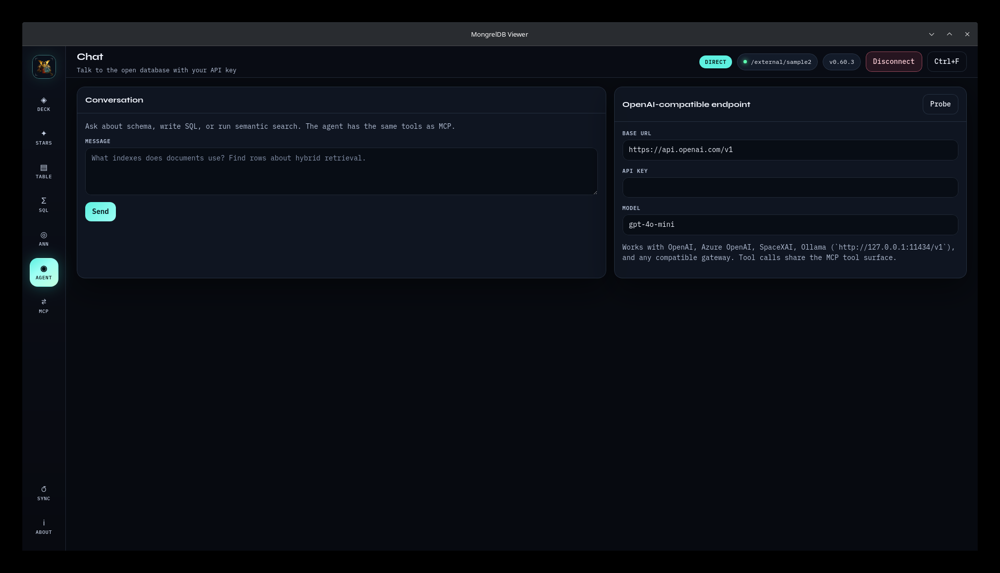

# Agent chat

**Agent** connects an OpenAI Chat Completions-compatible model to the current
database through the same tools used by MCP.



## Requirements

The endpoint and selected model must support:

- JSON Chat Completions responses,
- `choices[0].message`,
- OpenAI-style function tools,
- assistant `tool_calls`,
- tool result messages,
- bearer authentication, or ignored bearer credentials.

Viewer does not implement the Responses API, streaming, native Azure
`api-key` headers, provider-specific query parameters, or nonstandard tool-call
formats. Use an OpenAI-compatible gateway when a provider differs.

## Configuration

| Field | Default | Purpose |
| --- | --- | --- |
| Base URL | `https://api.openai.com/v1` | Root or full Chat Completions endpoint |
| API key | Empty | Bearer token |
| Model | `gpt-4o-mini` | Model identifier sent in each request |

The API key is optional. Leave it empty for an unauthenticated local endpoint.

### URL resolution

Chat URL:

| Base URL shape | Request URL |
| --- | --- |
| Ends in `/chat/completions` | Used exactly |
| Ends in `/v1` | Append `/chat/completions` |
| Any other root | Append `/v1/chat/completions` |

Examples:

```text
https://api.openai.com/v1
http://127.0.0.1:11434/v1
https://gateway.example/openai/v1
https://gateway.example/v1/chat/completions
```

## Save and probe

Clicking **Save**:

1. persists only Base URL and model in WebView `localStorage`,
2. sends a 15-second `GET` probe to a derived `/models` endpoint,
3. displays the probe JSON in the success banner.

Storage key:

```text
mongreldb-viewer.chat-config
```

The API key is excluded from persistent storage and remains in memory until
process exit. Viewer rewrites legacy saved entries with a Base URL/model
allowlist when it loads them, removing `apiKey` and any other fields. Save
still probes with the key currently in memory.

Some compatible gateways allow Chat Completions but do not expose `/models`.
In that case the probe can report failure while chat still works.

## Ask a question

1. Connect a Direct root or Server.
2. Configure an endpoint. Save it if you want to retain its URL and model.
3. Enter a message.
4. Click **Send**.

Good first requests:

```text
List every table and summarize its indexes.
```

```text
Describe documents, then count rows by status using SQL.
```

```text
Search documents for hybrid retrieval and explain the scores.
```

The model decides whether to call tools. The default system instruction tells
it to inspect schema before guessing and to prefer `SELECT`, but this is
guidance, not enforcement.

## Tool loop

For each Send, Viewer:

1. prepends its built-in MongrelDB system instruction,
2. sends the full current conversation and tool definitions,
3. uses `tool_choice: auto` and temperature `0.2`,
4. executes every returned tool call,
5. appends JSON tool results,
6. sends the expanded transcript again,
7. stops at a final assistant message or after eight model rounds.

Each model HTTP request has a 180-second timeout. One round can contain multiple
tool calls. Responses are displayed only after a request completes; token
streaming is not implemented.

The transcript shows user, assistant, and tool messages. Tool result JSON can
include schema and database rows.

## Available tools

| Tool | Read/write |
| --- | --- |
| `list_tables` | Read |
| `describe_table` | Read |
| `database_overview` | Read |
| `constellation` | Read |
| `list_embedding_providers` | Read |
| `execute_sql` | **Read or write, based on SQL** |
| `semantic_search` | Read |
| `install_dense_ann` | **Schema/vector write, Direct only** |
| `reindex` | **Maintenance write** |

There is no per-tool confirmation dialog and no SQL allowlist. A model can run
DDL or DML through `execute_sql` if it chooses and the connection permits it.
Use the disposable demo first and least-privilege Server credentials for remote
data.

Complete schemas and defaults are in [MCP tool reference](mcp.md#tool-reference).

## Connection lifecycle

- Tools always resolve the currently active database.
- Disconnect makes later database tools fail with `no database is open`.
- Disconnect clears conversation messages, tool results, and draft input.
- Every successful new connection clears the same state again.
- Conversation history is not persisted across process exit.

Saved endpoint URL/model configuration persists across process exit. The API
key does not.

## Data sent to the model provider

Every request can include:

- your message,
- prior conversation,
- the built-in system instruction,
- all tool schemas,
- assistant tool-call arguments,
- tool results such as table names, schemas, SQL results, ANN hits, and errors.

Do not assume a prompt stays local merely because the database uses Direct
mode. Direct controls database transport; Agent still sends its transcript to
the configured endpoint.

## Semantic search through Agent

`semantic_search` is table-scoped. The model must identify:

- table,
- query text,
- optional embedding column,
- optional `k`,
- optional minimum score,
- optional projection.

Direct mode prefers native `retrieve_text`; Server mode embeds locally and
sends ANN SQL. Agent uses the same local MiniLM provider as the ANN page, not
the chat model's embedding endpoint.

## Troubleshooting

### Send remains disabled

Enter a message. Save is recommended so the endpoint is probed and its URL/model
settings are retained.

### Probe reports 401 or 403

Check bearer key scope and the derived `/models` endpoint. A provider requiring
another auth header is not directly compatible.

### Probe reports 404

Use a Base URL ending in `/v1`, or use a gateway that exposes `/v1/models`.
Chat may still work if only the models-list route is absent.

### `unexpected chat response`

Viewer could not find `choices[0].message`. Confirm the endpoint is Chat
Completions-compatible, not Responses-only.

### No tool calls

Confirm the model supports function tools. Some local models accept the field
but do not produce valid `tool_calls`.

### Tool errors

Tool errors are returned to the model as JSON. Common causes are:

- no database is open,
- table or column does not exist,
- mutating operation is Server-restricted,
- ANN is absent,
- SQL is unsupported or unauthorized.

### Request times out

One model request can wait 180 seconds. Reduce prompt/tool-result size, use
selective SQL projections, or inspect provider latency.

Full environment and storage help:
[Operations](operations.md#troubleshooting).

## Security checklist

- Use a scoped, revocable API key.
- Close Viewer after use to clear the key from process memory.
- Use HTTPS for non-loopback endpoints.
- Start with a read-only Server identity when possible.
- Do not put secrets into SQL literals or prompts.
- Review tool messages for unexpected writes.
- Disconnect before moving to another database; Viewer clears the transcript.

Related: [MCP](mcp.md) · [SQL](sql.md) · [ANN](ann.md) ·
[Security](../SECURITY.md)
