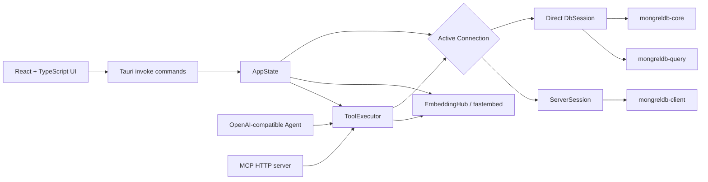
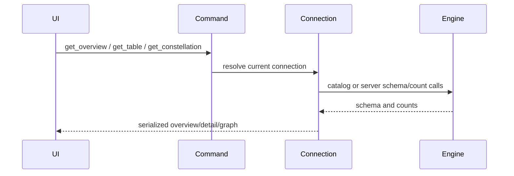
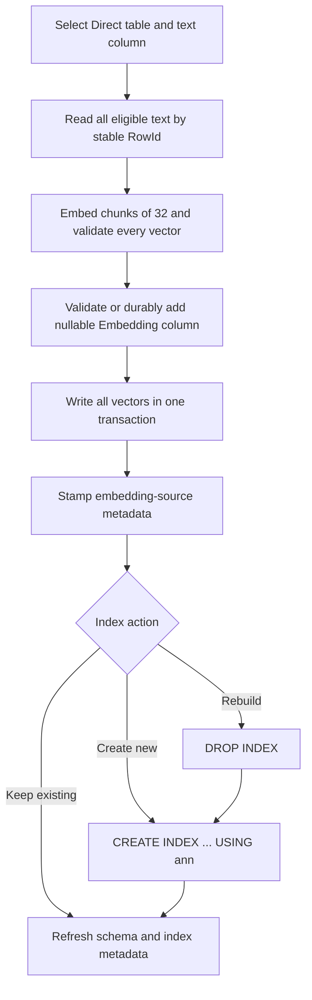

# Architecture and internal interfaces

This document explains how the repository is assembled, how a request moves
through it, which state is shared, and which interfaces are intended for
external use.

## System map



The GUI has one Rust `AppState`:

```text
db          Arc<RwLock<Option<Connection>>>
embeddings  EmbeddingHub
mcp         Mutex<Option<McpHandle>>
```

SQL, semantic search, Agent, and in-app MCP all resolve the same current
connection. A reconnect changes the database seen by future tool calls.

## Technology snapshot

The manifests are authoritative. At the current source revision:

| Layer | Technology |
| --- | --- |
| Desktop shell | Tauri 2 |
| Frontend | React 19, TypeScript 5.9, Vite 8 |
| Rust edition / minimum | 2021 / 1.88 |
| MongrelDB train | `mongreldb-core`, `query`, `client`, and `kit` 0.64.14 |
| Columnar result conversion | Arrow 58 |
| Async runtime and HTTP | Tokio, Reqwest, Axum |
| Local embeddings | fastembed 5, `all-MiniLM-L6-v2` |

All four `mongreldb-*` crates stay on the same version train. Direct and Server
paths intentionally use the official engine/query/client APIs instead of
reimplementing storage or protocol behavior.

## Source layout

```text
src/
  App.tsx                    Application state, navigation, and page composition
  components/
    AboutPages.tsx           About, license, and credit views
    CommandPalette.tsx       Searchable action launcher
    Constellation.tsx        Schema graph layout and SVG interaction
    DataTable.tsx            Shared result table
    SqlWorkbench.tsx         SQL editor, recipes, history, CSV copy
    TableBrowser.tsx         Live row sampling
  lib/
    api.ts                   Typed wrappers around Tauri invoke
    platform.ts              Platform shortcut labels
    recents.ts               Recent connection localStorage
  styles/global.css          Complete UI theme and layout

src-tauri/
  src/
    main.rs                  GUI vs --mcp-stdio process entry
    lib.rs                   Tauri setup and command registration
    commands/mod.rs          Tauri command boundary and AppState
    models.rs                Serialized request and response contracts
    error.rs                 User-facing error categories
    db/
      connection.rs          Direct/Server enum and HTTP adapter
      session.rs             Direct open, demo seed, Kit sidecar
      inspect.rs             Overview, table detail, constellation
      insights.rs            Schema-derived cards and SQL recipes
      sql.rs                 SQL execution, REINDEX, Arrow to JSON
      ann.rs                 ANN schema work, backfill, semantic search
    embeddings/mod.rs        Local and internal remote providers
    chat/mod.rs              Chat Completions tool loop
    mcp/
      server.rs              HTTP and JSON-lines stdio transports
      tools.rs               Shared tools and execution
    legal.rs                 Compile-time bundled legal documents
    linux_display.rs         WebKit defaults and desktop integration
  legal/                     Generated license inventories and notices
  tests/fixtures/            Frozen cross-version demo root
  capabilities/default.json Tauri permissions
  tauri.conf.json            Window, CSP, build, and bundle configuration

scripts/
  regen-credits.sh           Rebuild Cargo/npm legal inventories
  gen-compat-fixture.sh      Deliberately replace frozen compatibility fixture
  install-icons-linux.sh     Development desktop/icon integration
```

## Frontend boundary

`src/lib/api.ts` is a typed internal adapter around Tauri's `invoke`. It is not
a published JavaScript SDK. MCP is the documented public integration surface.

`App.tsx` owns page-level React state:

- current view and selected table,
- open form fields,
- SQL text, result, and in-memory history,
- ANN controls and result,
- Agent configuration and conversation,
- MCP status and port.

The backend owns database, provider, and server lifetimes. Data crossing
`invoke` is serialized with camelCase field names from Rust models.

## Connection abstraction

`Connection` has two variants:

```rust
enum Connection {
    Direct(DbSession),
    Server(ServerSession),
}
```

### Direct

`DbSession` owns:

- root `PathBuf`,
- `Arc<mongreldb_core::Database>`,
- `Arc<mongreldb_query::MongrelSession>`,
- open timestamp,
- a credential-present marker.

Opening creates the query session over the same embedded database. Dropping the
connection releases its handles and exclusive lock.

### Server

`ServerSession` owns:

- normalized base URL,
- cloneable `MongrelClient`,
- open timestamp,
- health response.

Connect validates health and `list_tables`. Schema inspection uses the client's
Kit schema endpoint; counts use the count endpoint; SQL uses the SQL endpoint.

### Avoiding locks across async work

Commands snapshot cloneable handles while holding the `RwLock`, then release
the guard before awaiting. Direct SQL clones `Arc<MongrelSession>`. Server SQL
clones `MongrelClient` and performs its blocking request in
`tokio::task::spawn_blocking`.

This keeps Agent, MCP, UI refresh, and database work from holding a
`parking_lot` guard across an async suspension.

## Inspection flow



Direct table counts use the engine table count. Server overview performs schema
and count calls per table. Direct graph construction can resolve foreign keys;
the current Server adapter returns none.

Insights are derived from schema, not demo table names. They:

- add generic browse and count recipes,
- prefer Bitmap columns for group-by suggestions,
- recognize numeric, temporal, text, nullable, and embedding columns,
- run at most four live group-by probes,
- return at most 28 unique SQL suggestions.

## SQL flow

1. UI invokes `execute_sql` with SQL and an optional row cap.
2. `Connection::sql_work` selects Direct session or Server client.
3. The engine returns Arrow `RecordBatch` values.
4. `db/sql.rs` converts supported Arrow scalars to JSON.
5. Viewer truncates rows to the cap and returns metadata.

Default cap is 500 and the backend clamps it to `1..=10_000`.

Representation details:

- `Int64`, `UInt64`, and native row IDs outside JavaScript's safe integer range
  become exact decimal strings,
- UTF-8 binary values become strings.
- Non-UTF-8 binary values become a `\x...` preview of at most 64 bytes.
- f32 fixed-size lists longer than eight values become an object with
  `dim` and first/last-four `preview`.
- unsupported Arrow values render as a type placeholder.

Statement kind is a display classification based on the first SQL token. It is
not an authorization boundary.

## ANN installation flow

For a new ANN surface, the desktop UI uses column `embedding` and the selected
provider's 384-dimensional vectors. For an existing ANN surface, it targets the
first ANN index's actual embedding column and dimension. It sends no default
backfill ceiling.



Null and empty source values are skipped. An explicit API `backfill_limit` is a
preflight ceiling, not a truncation limit: the request fails before embedding
or schema changes when more rows are eligible.

Vector preparation completes before schema mutation. Vector writes use one
core transaction, so a failed update commits none of them. Source metadata is
written only after the vector commit.

DDL is separate. A failed initial create can leave a fully embedded column
without ANN. On rebuild, `DROP INDEX` occurs before replacement
`CREATE INDEX`; a failed create can leave the column without ANN. Back up
important roots before changing backends.

## Semantic search flow

Direct:

1. Confirm the table has ANN on the embedding column.
2. Resolve and register the provider recorded on the embedding column.
3. Try native `retrieve_text`.
4. Hydrate returned row IDs and attach semantic-identity provenance.
5. If native retrieval is unavailable, build `ann_search_exact` SQL.
6. If exact SQL fails, fall back to raw `ann_search`.
7. Apply minimum-score filtering when a recognized exact/native score exists.

Application-supplied vectors have no known provider. They require an explicit
matching `provider_id`; search never rewrites their source metadata.

Server:

1. Embed query text in the Viewer process.
2. Send `ann_search_exact` SQL with a wider candidate set.
3. Fall back to raw `ann_search` if needed.

Exact rerank requests up to `min(k * 20, 1000)` candidates and returns at most
`k`. Backend `k` is clamped to `1..=1000`; the desktop input clamps to
`1..=100`.

## Shared Agent and MCP tools

`ToolExecutor` is the single implementation used by both integrations:

```text
list_tables
describe_table
database_overview
execute_sql
semantic_search
install_dense_ann
reindex
constellation
list_embedding_providers
```

This prevents behavior drift between an in-app model and an external MCP
client. Tool definitions are converted directly into OpenAI function tools for
Agent.

### Agent

The Agent backend:

1. prepends its default MongrelDB system instruction,
2. posts Chat Completions with tools and `tool_choice: auto`,
3. executes returned calls through `ToolExecutor`,
4. appends JSON tool results,
5. repeats for at most eight model rounds,
6. returns the full UI transcript and tool traces.

Each model request has a 180-second timeout. The implementation is
non-streaming and uses temperature `0.2`.

### In-app MCP

The Axum listener shares `AppState.db` and `EmbeddingHub`. Starting it again
stops the previous handle first. Stopping or dropping the database does not
automatically stop the listener.

HTTP routes:

```text
GET  /
GET  /health
POST /mcp
GET  /sse
```

`/sse` only advertises `/mcp`; it is not a full server event stream.

### Stdio MCP

`--mcp-stdio` bypasses Tauri entirely. It creates a new database state,
optionally opens one connection from environment variables, and reads one
JSON-RPC object per line. It does not share GUI memory or the GUI connection.

## Legal-document pipeline

License texts and inventories are compiled into the binary with `include_str!`.
They work offline and cannot drift from the built artifact after compilation.

After dependency changes:

```sh
scripts/regen-credits.sh
```

The script reads Cargo metadata, installed npm packages, lock metadata, and
package license files. Generated files live in `src-tauri/legal/`.

## Compatibility fixture

`src-tauri/tests/fixtures/sample-demo-v0.64.5.tar.gz` is deliberately old. Tests
unpack it and verify:

- current Direct open and WAL/catalog recovery,
- demo table names and counts,
- SQL joins and point reads,
- Kit open through `kit_schema.json`.

Do not refresh it during a routine engine bump. Replacing it destroys the
cross-version assertion. The ignored regeneration test requires
`REGEN_COMPAT_FIXTURE=1` and is wrapped by
`scripts/gen-compat-fixture.sh`.

## Trust boundaries

| Boundary | Risk |
| --- | --- |
| Direct root | Viewer can mutate durable data and owns the exclusive lock |
| Server HTTP | Auth and database data cross the configured network |
| Agent endpoint | Transcript, schema, rows, and tool results can leave the machine |
| In-app MCP | Any local process reaching the unauthenticated port can call tools |
| Stdio MCP parent | Parent controls environment, input requests, and output handling |
| Model cache | Downloaded artifacts are executable model inputs on the local account |
| WebView storage | Saved Agent URL/model preferences and recent non-secret connection locations |
| Process memory | Agent API key and current connection credentials |

The Tauri capability file permits the core window/event APIs, opener, and
dialog operations needed by the UI. The CSP is defined in
`src-tauri/tauri.conf.json`.

## External compatibility promises

Public:

- Direct MongrelDB roots supported by the linked engine train,
- `mongreldb-server` endpoints supported by the linked client,
- MCP tools and transports documented in [mcp.md](mcp.md),
- OpenAI-style Chat Completions with bearer auth and tool calls.

Internal and subject to change:

- Tauri command names and payloads,
- `src/lib/api.ts` types,
- React component boundaries,
- generated insight heuristics.

## Adding a feature

Use the shortest existing path:

- New UI-only behavior: keep it in the owning component or `App.tsx`.
- New database operation: add a model, a command, and one typed wrapper.
- Operation needed by Agent and MCP: implement it once in `ToolExecutor`.
- Connection-aware operation: route through `Connection`; keep Direct-only
  mutation explicit.
- Dependency change: regenerate legal inventories.
- Behavior with compatibility risk: add the smallest focused Rust test.

See [CONTRIBUTING.md](../CONTRIBUTING.md) for the required gate.

Related: [Connections](connections.md) · [ANN](ann.md) · [Agent](agent.md) ·
[MCP](mcp.md)
