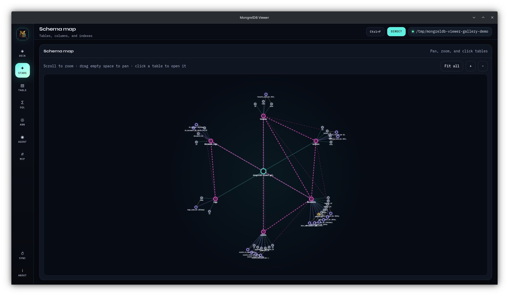

# Schema map

**Stars** renders the current schema as a pan-and-zoom SVG constellation.

## Graph model

| Node | Contents |
| --- | --- |
| Database | Direct root name or Server host, table count |
| Table | Name, rows, columns, indexes, ANN readiness |
| Column | Name, type, flags, embedding metadata |
| Embedding | A column node with embedding dimension/source metadata |
| Index | Index name, family, covered column, option summary |

| Edge | Meaning |
| --- | --- |
| `owns` | Database to table |
| `column` | Table to column |
| `index` | Table to index |
| `covers` | Index to indexed column |
| `fk` | Child table to referenced table |
| `fk-col` | Local foreign-key column to referenced table |

Foreign-key edges are pink and dashed. Index and coverage edges use distinct
violet and amber signals.

## Controls

- Scroll or trackpad to zoom around the pointer.
- Drag empty canvas space to pan.
- Click **+** or **-** for fixed zoom steps.
- Click **Fit all** to center the complete graph.
- Hover any node for a compact metadata preview.
- Click a table node to open it in **Table**.

Zoom is clamped between `0.25x` and `3.5x`.

Only table nodes navigate. Use the command palette or Table selector as a
keyboard-friendly alternative.

## Layout lifecycle

Viewer computes positions from the returned graph and refits when the graph
identity changes. Normal panning and zooming do not trigger a refit. **Sync**
rebuilds graph data after schema changes.

Positions are UI state only. They are not written into the database or saved
across launches.

## Direct and Server differences

Direct inspection reads foreign keys from the live core schema, so Stars can
draw table-to-table relationships and local-column links.

The current Server adapter receives columns and indexes from Kit schema but
does not expose foreign keys. Server Stars therefore shows database, table,
column, and index structure without FK edges.

## Large schemas

Every table expands into its columns and secondary indexes. Large catalogs can
produce a dense graph and, in Server mode, require schema/count requests for
each table.

Use:

- **Fit all** for orientation,
- Table selector or command palette for direct navigation,
- Deck capability chips for a faster index overview,
- SQL `information_schema` queries for tabular catalog work.

## Empty or stale map

If Stars is empty:

1. confirm a database is connected,
2. click **Sync**,
3. verify Server mode can list tables and return Kit schemas,
4. inspect the error banner for the first failing table.

Related: [Deck](deck.md) · [Table](table.md) ·
[Connection differences](connections.md)
