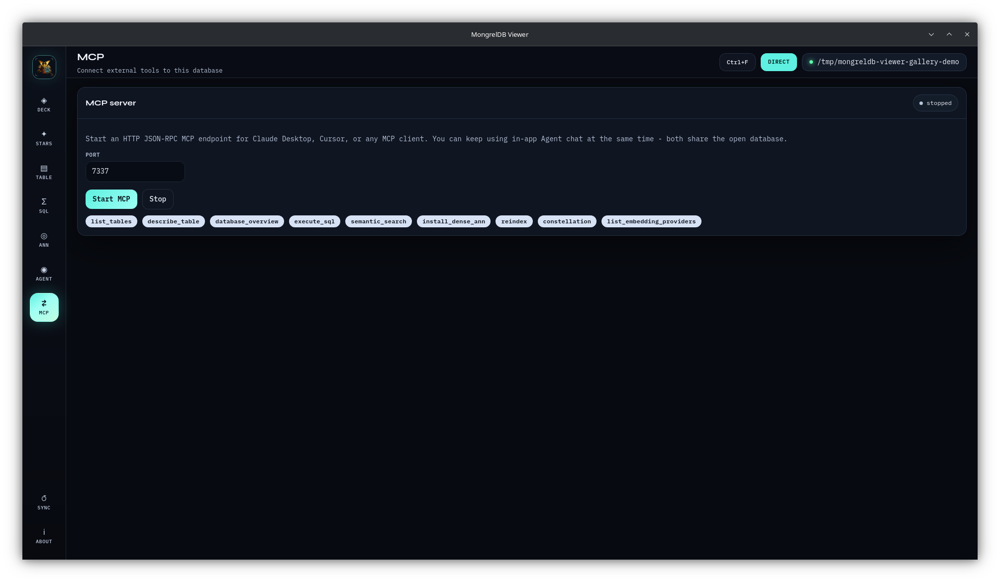

# MCP bridge

MongrelDB Viewer exposes its database tools to external model clients through:

- an in-app loopback HTTP JSON-RPC server sharing the GUI connection,
- a separate headless JSON-lines stdio process.



## Pick a transport

| Transport | Database state | Best for |
| --- | --- | --- |
| In-app HTTP | Shares the current GUI Direct/Server connection | Local clients while Viewer is open |
| Stdio | Opens its own Direct/Server connection from environment | IDE/terminal-managed child process |

Stdio does not attach to the GUI process. A stdio Direct process cannot open a
root already locked by GUI Direct mode.

## In-app HTTP

1. Connect a database.
2. Open **MCP**.
3. Choose a port, default `7337`.
4. Click **Start MCP**.
5. Use the displayed `http://127.0.0.1:<port>/mcp` URL.
6. Click **Stop MCP** when finished.

The UI always binds host `127.0.0.1`. The backend can accept another host
internally, but the public desktop form does not expose it.
Use a port from 1 through 65,535.

Starting MCP again stops the prior listener before binding the new one. If the
new bind fails, the prior listener is already stopped.

### Routes

| Method | Path | Purpose |
| --- | --- | --- |
| GET | `/` | Plain-text service hint |
| GET | `/health` | JSON health check |
| POST | `/mcp` | JSON-RPC requests |
| GET | `/sse` | Minimal endpoint advertisement only |

Health:

```sh
curl http://127.0.0.1:7337/health
```

Expected:

```json
{"ok":true,"service":"mongreldb-viewer-mcp"}
```

### Protocol methods

Viewer advertises MCP protocol version `2024-11-05` and implements:

| Method | Result |
| --- | --- |
| `initialize` | Server info, protocol version, tools capability, instructions |
| `notifications/initialized` | Accepted |
| `initialized` | Accepted alias |
| `ping` | Empty success object |
| `tools/list` | Complete tool definitions |
| `tools/call` | Tool output |
| `resources/list` | Empty resources array |
| `prompts/list` | Empty prompts array |

Unknown methods return JSON-RPC error `-32601`.

### Initialize with curl

```sh
curl \
  -H 'Content-Type: application/json' \
  -d '{"jsonrpc":"2.0","id":1,"method":"initialize","params":{"protocolVersion":"2024-11-05","capabilities":{},"clientInfo":{"name":"curl","version":"1"}}}' \
  http://127.0.0.1:7337/mcp
```

List tools:

```sh
curl \
  -H 'Content-Type: application/json' \
  -d '{"jsonrpc":"2.0","id":2,"method":"tools/list","params":{}}' \
  http://127.0.0.1:7337/mcp
```

Call `list_tables`:

```sh
curl \
  -H 'Content-Type: application/json' \
  -d '{"jsonrpc":"2.0","id":3,"method":"tools/call","params":{"name":"list_tables","arguments":{}}}' \
  http://127.0.0.1:7337/mcp
```

Tool calls return:

- pretty JSON in `content[0].text`,
- the native JSON value in `structuredContent`,
- `isError: true` when the tool failed.

A tool failure is represented inside a successful JSON-RPC result so the model
client can read it.

### HTTP compatibility boundary

The HTTP implementation is a direct POST JSON-RPC endpoint. It does not
implement streamable-HTTP session IDs or a full SSE event stream. `/sse`
returns one endpoint event for probing.

Clients that accept a URL-based MCP JSON-RPC endpoint can use it. Clients that
require a full session/stream transport may need stdio or a small compatible
bridge.

## Client configuration

Viewer displays a generic URL snippet:

```json
{
  "mcpServers": {
    "mongreldb-viewer": {
      "url": "http://127.0.0.1:7337/mcp"
    }
  }
}
```

The exact settings file and transport key depend on the client. Use the
endpoint shown in Viewer rather than assuming port `7337`.

## Stdio

Build or install the binary, then launch:

```sh
MONGRELDB_VIEWER_PATH=/absolute/path/to/root \
  /absolute/path/to/mongreldb-viewer --mcp-stdio
```

Server mode:

```sh
MONGRELDB_VIEWER_SERVER=http://127.0.0.1:8453 \
  /absolute/path/to/mongreldb-viewer --mcp-stdio
```

Optional Server auth variables:

```text
MONGRELDB_VIEWER_TOKEN
MONGRELDB_VIEWER_USER
MONGRELDB_VIEWER_PASSWORD
```

If both Direct path and Server URL are set, Direct wins. Direct stdio has no
environment-variable support for catalog credentials or encryption
passphrases. Set `MONGRELDB_VIEWER_USER` and
`MONGRELDB_VIEWER_PASSWORD` together for Server basic auth.

With neither variable, the process starts with no database. Schema, SQL, and
search tools return `no database is open`.

### Generic stdio client entry

```json
{
  "mcpServers": {
    "mongreldb-viewer": {
      "command": "/absolute/path/to/mongreldb-viewer",
      "args": ["--mcp-stdio"],
      "env": {
        "MONGRELDB_VIEWER_PATH": "/absolute/path/to/root"
      }
    }
  }
}
```

For Server auth, inject secrets through the client's secret/environment
facility. Do not commit tokens or passwords into a settings file.

### Stdio framing

Viewer reads one JSON-RPC object per newline and writes one response object per
newline. Blank lines are ignored. Parse failures return code `-32700`.
Notifications whose method starts with `notifications/` and whose ID is null
produce no stdout response.

## Connection lifecycle

### In-app

- Tools resolve the GUI's current connection at call time.
- Reconnecting changes the database used by later calls.
- Disconnect does not stop the HTTP listener.
- While disconnected, database tools return `no database is open`.
- Stop MCP separately from the MCP page.

### Stdio

- The child owns its connection until stdin closes or the process exits.
- Direct owns its own exclusive lock.
- Server mode is multi-client.
- No GUI is created.

## Tool reference

### `list_tables`

Lists all tables with row counts, column/index counts, index-family flags, and
embedding dimensions.

Input:

```json
{}
```

Mode: read.

### `describe_table`

Returns schema ID, row count, columns, flags, indexes, radar counts, and
Direct-mode foreign keys.

Input:

```json
{
  "table": "documents"
}
```

`table` is required.

Mode: read.

### `database_overview`

Returns connection metadata, linked engine/query versions, all table summaries,
and loaded embedding providers.

Input:

```json
{}
```

Mode: read.

### `execute_sql`

Runs arbitrary SQL.

Input:

```json
{
  "sql": "SELECT id, status FROM documents LIMIT 25",
  "max_rows": 500
}
```

| Argument | Required | Default | Bounds |
| --- | :---: | ---: | --- |
| `sql` | Yes | | Non-empty string |
| `max_rows` | No | 500 | 1..10,000 |

Mode: **read or write**. There is no SQL allowlist.

### `semantic_search`

Embeds query text locally and searches one table.

Input:

```json
{
  "table": "documents",
  "embedding_column": "embedding",
  "query": "hybrid retrieval",
  "k": 5,
  "provider_id": "viewer-minilm",
  "exact_rerank": true,
  "min_score": 0.25,
  "projection": "id, body, status"
}
```

| Argument | Required | Default | Notes |
| --- | :---: | --- | --- |
| `table` | Yes | | One table only |
| `query` | Yes | | Natural-language text |
| `embedding_column` | No | `embedding` | Must have ANN |
| `k` | No | 5 | Backend clamps 1..1,000 |
| `provider_id` | No | Recorded source | Required for application-supplied vectors; must match their model |
| `exact_rerank` | No | `true` | Prefer `ann_search_exact` |
| `min_score` | No | Off | Cosine floor where exact/native cosine score exists |
| `projection` | No | Auto | SQL projection string |

Direct prefers native `retrieve_text`; Server uses ANN SQL. Search reads source
metadata but never changes it.

Mode: read.

### `install_dense_ann`

Adds/rebuilds ANN and optionally backfills vectors. Direct only.

Minimal:

```json
{
  "table": "documents",
  "source_text_column": "body"
}
```

Full example:

```json
{
  "table": "documents",
  "embedding_column": "embedding",
  "dimension": 384,
  "source_text_column": "body",
  "provider_id": "viewer-minilm",
  "backfill_limit": 5000,
  "algorithm": "hnsw",
  "quantization": "product",
  "product_num_subvectors": 48,
  "product_bits": 8,
  "rebuild": true
}
```

| Argument | Default | Notes |
| --- | --- | --- |
| `table` | Required | Direct table |
| `embedding_column` | `embedding` | Added nullable when absent |
| `dimension` | 384 | Valid 1..4,096 |
| `source_text_column` | None | When set, backfill vectors |
| `provider_id` | `viewer-minilm` | Must be available |
| `backfill_limit` | None | Optional preflight ceiling; omit for all eligible rows |
| `algorithm` | `hnsw` | `hnsw`, `diskann`, `ivf` |
| `quantization` | `dense` | `dense`, `binary_sign`, `product` |
| `product_num_subvectors` | Required for Product | Must divide dimension |
| `product_bits` | 8 | Only 8 supported |
| `diskann_r` | Engine default | DiskANN degree |
| `diskann_l` | Engine default | DiskANN build search list |
| `diskann_beam_width` | Engine default | DiskANN query beam |
| `ivf_nlist` | Engine default | IVF lists |
| `ivf_nprobe` | Engine default | IVF probes |
| `rebuild` | `false` | Drop current ANN before create |

Supported pairs:

```text
hnsw × dense
hnsw × binary_sign
hnsw × product
diskann × dense
ivf × dense
```

Mode: **schema and data write**.

Backfill reads rows by stable internal RowId, embeds and validates all vectors
before schema mutation, then writes every vector in one transaction. If an
explicit `backfill_limit` is below the eligible row count, the call fails
without partial work.

### `reindex`

Runs analyze, compact, and garbage collection.

One table:

```json
{
  "table": "documents"
}
```

Whole database:

```json
{}
```

Direct calls the local engine. Server sends `REINDEX` SQL. Simple table names
must contain only ASCII letters, digits, and underscore.

Mode: **maintenance write**.

### `constellation`

Returns database/table/column/index graph nodes and edges.

Input:

```json
{}
```

Mode: read.

### `list_embedding_providers`

Returns process-loaded embedding providers. The local provider does not appear
until load was attempted successfully or failed.

Input:

```json
{}
```

Mode: read.

## Security

The in-app HTTP server:

- has no authentication,
- has no tool-level authorization,
- can execute mutating tools,
- is intended for loopback only,
- remains alive across database disconnect until explicitly stopped.

Any local process able to reach the port can call it. OS user separation,
firewall policy, and local process trust are the security boundary.

For stdio, the parent client can invoke every tool and read every response.
Environment secrets are visible to the child and may be visible to process
inspection depending on OS policy.

## Troubleshooting

- **Address already in use**: choose another port.
- **No database is open**: connect in the same GUI process, or set a stdio
  connection variable.
- **Direct action required**: `install_dense_ann` cannot mutate a Server
  connection.
- **Client rejects HTTP transport**: use stdio or a bridge supporting the
  client's required session transport.
- **Tool call isError**: inspect `structuredContent.error`.
- **Stdio has no replies**: send one complete JSON object followed by newline;
  do not use HTTP Content-Length framing.
- **Direct stdio lock error**: disconnect GUI Direct first.

Related: [Agent](agent.md) · [ANN](ann.md) · [Connections](connections.md) ·
[Security](../SECURITY.md)
